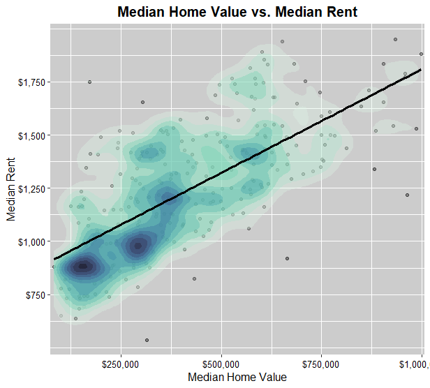
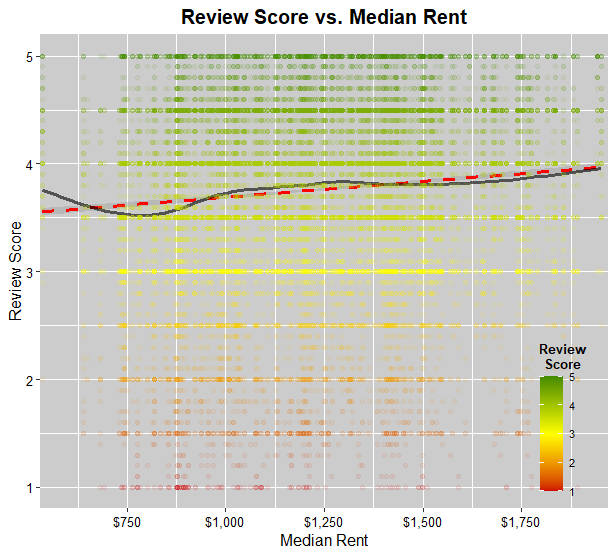
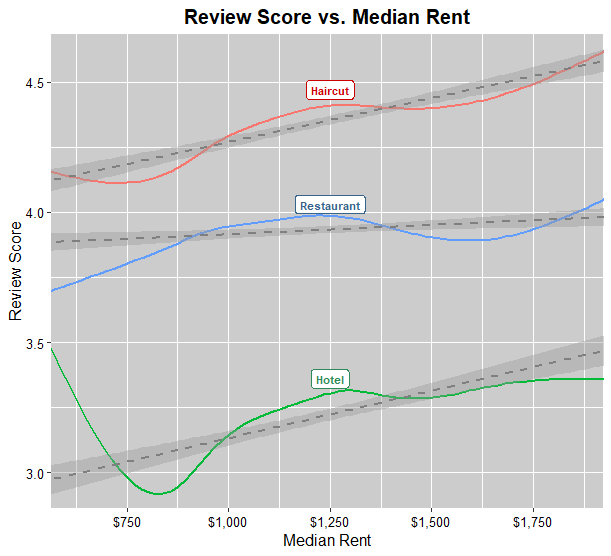

# Data Scientist

### Education
#### M.S. Business Analytics & Data Science - Oklahoma State University  
&nbsp;&nbsp;&nbsp;&nbsp;01/2022 - 12/2015 (anticipated) 
&nbsp;&nbsp;&nbsp;&nbsp;GPA: 4.0 
 
&nbsp;&nbsp;&nbsp;&nbsp;Relevant Courses:  
&nbsp;&nbsp;&nbsp;&nbsp;- Advanced Business Analytics 
&nbsp;&nbsp;&nbsp;&nbsp;- Prescriptive Business Analytics  
&nbsp;&nbsp;&nbsp;&nbsp;- Descriptive Business Analytics  
&nbsp;&nbsp;&nbsp;&nbsp;- Programming for Data Science  
&nbsp;&nbsp;&nbsp;&nbsp;- Data Warehousing 

#### B.S. Environmental Science - University of Oklahoma
&nbsp;&nbsp;&nbsp;&nbsp;01/2007 - 05/2011 
&nbsp;&nbsp;&nbsp;&nbsp;GPA: 3.61, magna cum laude 

### Certificates
#### Graduate Certificate - Business Analytics & Data Science - Oklahoma State University 
&nbsp;&nbsp;&nbsp;&nbsp;01/2022 - 05/2023 
&nbsp;&nbsp;&nbsp;&nbsp;GPA: 4.0

#### IBM Data Science Professional Certificates - 08/2023
- Databases & SQL for Data Science in Python 
- Machine Learning with Python
- Python for Data Science, AI & Development

### Projects
- 2023 Humana-Mays Healthcare Analytics Case Competition - Top 35 Predictive Model, Second Round Contestant  
&nbsp;&nbsp;&nbsp;&nbsp;(link to be added after NDA expiry)
- Estimating Soil Parameters from Hyperspectral Images 
&nbsp;&nbsp;&nbsp;&nbsp;(link to be added)
- #### Webscraping: Customer Reviews Across Socioeconomic Gradients
I spearheaded this project with exploration into the interplay between socioeconomic dynamics and customer reviews in the vibrant landscape of California, one of America's most diverse states. Our approach involved the strategic sampling of 500 zip codes, utilizing Selenium in Python to scrape customer review data from Yelp across strategic business categories, promising a deep dive into meaningful insights. This initiative revealed the intricate realm of consumer behavior patterns in diverse socioeconomic landscapes...[Link to Github Repo](https://github.com/ekmolzn/Socioeconomic-Web-Scraping-Gradient-Project)

- [Text Analytics - Sentiment Analysis](https://youtu.be/XUOJAnWFNXE?si=W_bSSvfw-6oVeDIx)

- #### Predicting NBA Player Outcomes with Machine Learning 
Given datasets for each player and factoring in their age, salary, and contract agreements, which player should be chosen?  This was a fun case utilizing a model pipeline in SAS to utilize machine learning to inform decisions...[Link to Youtube](https://youtu.be/J8Evj1pHUYk?si=0HYmugG7T1O2Jjo_)

- [Detecting Money Laundering with Descriptive Analytics](https://youtu.be/Tj0h7V5KSWk?si=S7JdzrT7RXcYY3mI)

### Visualizations
- [Ethereum Dashboard (Looker Studio)](/Assets/Looker_Studio_Reporting_-_9_18_23,_10_39 PM.pdf)
- [Ethereum Forecast (GCP BQ/Looker Studio)](Assets/Ethereum_forecast.png)

### Work Experience
#### Team Leader | Antioch Community Church 
Udon Thani, Thailand 
2020-Present
- Successfully managed multiple time-sensitive priorities concurrently with minimal or no supervision  
- Demonstrated being a self-starter and the ability to handle ambiguity in a new environment 
- Initiated innovative projects to address historical challenges 
- Mentored Thais in development of work skills 
- Networked with other leaders and organizations 
- Interfaced with the corporate office, other teams, and prospective teammates 
- Acquired proficiency in speaking, reading, and writing Thai 
- Acclimated to new culture and way of life 
- Oversaw teams in social welfare initiatives 
- Collaborated with cross-cultural teams to achieve mutual objectives  
- Conducted translations from Thai to English 

#### Team Member | Antioch Community Church
Chiang Mai, Thailand   2016-2020
- Leveraged advanced Excel skills to manage and track team budgets, thereby facilitating informed decision-making with leadership
- Acquired proficiency in speaking, reading, and writing Thai 
- Oversaw teams in social welfare initiatives 
- Collaborated with cross-cultural teams to achieve mutual objectives - Conducted translations from Thai to English 

#### Engineering Technician | Chesapeake Energy Corp. 
Oklahoma City, OK 
2013-2015
- Conducted comprehensive analysis and refinement of large operational datasets from multiple unstructured sources 
- Employed advanced skills in Excel, including VBA programming 
- Worked closely with my team members to ensure accuracy, reliability, and improved efficiencies 
- Managed multiple ongoing projects and responsibilities simultaneously 
- Updated routine KPIs and dashboards 
- Utilized TIBCO Spotfire to visualize insights and highlight emerging trends 

#### Air & Regulatory Scientist | EnviroClean
Oklahoma City, OK 
2012-2013
- Provided consultation services to clients to ensure accurate operational data capture
- Conducted engineering calculations for emissions reporting 
- Filed regulatory reports on behalf of five energy companies 

#### Lab Technician | OK Dept. Environmental Quality
Oklahoma City, OK 
2009-2011
- Balanced a part-time role while pursuing full-time college education 
- Demonstrated attention to detail, precision, and technique in various lab analyses, including: 
    - Ortho-Phosphate and Total Hardness using flow injection analysis 
    - Chlorophyll A/Pheophytin A through spectrophotometry 
- Mentored a new employee in the Chlorophyll A/Pheophytin A method 
- Prepared chemical reagents, maintaining high standards of safety and precision 
- Utilized Excel for data processing and report generation 
- Accurately input critical data into the database 

### Skills
Programming Languages: 
- Python
    - Python Libraries: Pandas, NumPy, Scikit-Learn, Matplotlib
- SQL
- R
Machine Learning: 
- Decision Tree
- Random Forest
- Gradient Boost (XG, LightGBM)
- Neural Networks
- Regression
- KNN
Deep Learning: 
- Convolutional Neural Networks (CNN)
- Recurrent Neural Networks (RNN)
Natural Language Processing: Text and Sentiment Analysis
Time Series: ARIMA
Statistical Analysis: 
- Hypothesis Testing
- ANOVA
Data Visualization: 
- Tableau,
- Power BI
- Looker Studio
Big Data Technologies: Spark
Database Management: 
- SSRS
- BigQuery
Data Cleaning: Regular Expressions, Data Preprocessing
Data Mining
Web Scraping
Other Software: 
- Excel (10 years)
- SAS
    - Viya
    - JMP
    - Model Builder