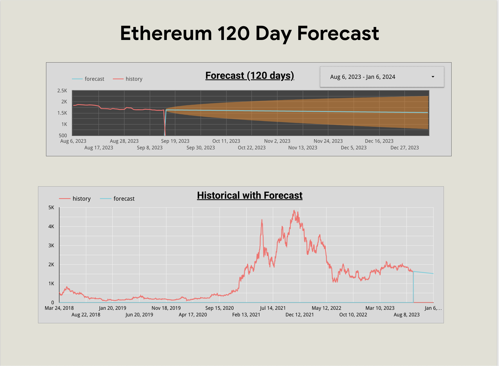

# Data Scientist

### Education
M.S. Business Analytics & Data Science - Oklahoma State University  
 01/2022 - 12/2015 (anticipated)
 GPA: 4.0
####  Relevant Courses
 - Advanced Business Analytics
 - Prescriptive Business Analytics 
 - Descriptive Business Analytics 
 - Programming for Data Science 
 - Data Warehousing

B.S. Environmental Science - University of Oklahoma 
&nbsp;&nbsp;&nbsp;&nbsp;01/2007 - 05/2011 
&nbsp;&nbsp;&nbsp;&nbsp;GPA: 3.61, magna cum laude 

### Certificates
Graduate Certificate - Business Analytics & Data Science - Oklahoma State University 
&nbsp;&nbsp;&nbsp;&nbsp;01/2022 - 05/2023 
&nbsp;&nbsp;&nbsp;&nbsp;GPA: 4.0

IBM Data Science Professional Certificates - 08/2023
- Databases & SQL for Data Science in Python 
- Machine Learning with Python
- Python for Data Science, AI & Development

### Projects
- 2023 Humana-Mays Healthcare Analytics Case Competition - Top 35 Predictive Model, Second Round Contestant 
&nbsp;&nbsp;&nbsp;&nbsp;(link to be added after NDA expiry)
- Estimating Soil Parameters from Hyperspectral Images
&nbsp;&nbsp;&nbsp;&nbsp;(link to be added)
- [Web Scraping Customer Reviews Across Socioeconomic Gradients](http://Customer%20Reviews%20Across%20Socioeconomic%20Gradients)
- [Text Analytics - Sentiment Analysis](https://youtu.be/XUOJAnWFNXE?si=W_bSSvfw-6oVeDIx)
- [Predicting NBA Player Outcomes with Machine Learning](https://youtu.be/J8Evj1pHUYk?si=0HYmugG7T1O2Jjo_)
- [Money Laundering Anaylysis with Descriptive Analytics](https://youtu.be/Tj0h7V5KSWk?si=S7JdzrT7RXcYY3mI)

### Visualizations
- [Looker Studio Ethereum Dashboard](/Assets/Looker_Studio_Reporting_-_9_18_23,_10_39 PM.pdf)
- 

### Work Experience
TEAM LEADER | ANTIOCH COMMUNITY CHURCH 
&nbsp;&nbsp;&nbsp;&nbsp;UDON, THAILAND  
&nbsp;&nbsp;&nbsp;&nbsp;2020-PRESENT 
&nbsp;&nbsp;&nbsp;&nbsp;- Successfully managed multiple time-sensitive priorities concurrently with minimal or no supervision  - Demonstrated being a self-starter and the ability to handle ambiguity in a new environment 
&nbsp;&nbsp;&nbsp;&nbsp;- Initiated innovative projects to address historical challenges 
&nbsp;&nbsp;&nbsp;&nbsp;- Mentored Thais in development of work skills 
&nbsp;&nbsp;&nbsp;&nbsp;- Networked with other leaders and organizations 
&nbsp;&nbsp;&nbsp;&nbsp;- Interfaced with the corporate office, other teams, and prospective teammates 
&nbsp;&nbsp;&nbsp;&nbsp;- Acquired proficiency in speaking, reading, and writing Thai 
&nbsp;&nbsp;&nbsp;&nbsp;- Acclimated to new culture and way of life 
&nbsp;&nbsp;&nbsp;&nbsp;- Oversaw teams in social welfare initiatives 
&nbsp;&nbsp;&nbsp;&nbsp;- Collaborated with cross-cultural teams to achieve mutual objectives  - Conducted translations from Thai to English 
TEAM MEMBER | ANTIOCH COMMUNITY CHURCH 
&nbsp;&nbsp;&nbsp;&nbsp;    CHIANG MAI, THAILAND 
    &nbsp;&nbsp;&nbsp;&nbsp;2016-2020 
    &nbsp;&nbsp;&nbsp;&nbsp;- Leveraged advanced Excel skills to manage and track team budgets, thereby facilitating informed decision-making with leadership 
    &nbsp;&nbsp;&nbsp;&nbsp;- Acquired proficiency in speaking, reading, and writing Thai 
    &nbsp;&nbsp;&nbsp;&nbsp;- Oversaw teams in social welfare initiatives 
    &nbsp;&nbsp;&nbsp;&nbsp;- Collaborated with cross-cultural teams to achieve mutual objectives - Conducted translations from Thai to English 
  
ENGINEERING TECHNICIAN | CHESAPEAKE ENERGY CORPORATION 
    &nbsp;&nbsp;&nbsp;&nbsp;Oklahoma City, OK  
    &nbsp;&nbsp;&nbsp;&nbsp;2013-2015 
    &nbsp;&nbsp;&nbsp;&nbsp;- Conducted comprehensive analysis and refinement of large operational datasets from multiple unstructured sources 
    &nbsp;&nbsp;&nbsp;&nbsp;- Employed advanced skills in Excel, including VBA programming 
    &nbsp;&nbsp;&nbsp;&nbsp;- Worked closely with my team members to ensure accuracy, reliability, and improved efficiencies 
    &nbsp;&nbsp;&nbsp;&nbsp;- Managed multiple ongoing projects and responsibilities simultaneously 
    &nbsp;&nbsp;&nbsp;&nbsp;- Updated routine KPIs and dashboards 
    &nbsp;&nbsp;&nbsp;&nbsp;- Utilized TIBCO Spotfire to visualize insights and highlight emerging trends 
 
AIR & REGULATORY SCIENTIST | ENVIROCLEAN 
    &nbsp;&nbsp;&nbsp;&nbsp;Oklahoma City, OK  
    &nbsp;&nbsp;&nbsp;&nbsp;2012-2013 
    &nbsp;&nbsp;&nbsp;&nbsp;- Provided consultation services to clients to ensure accurate operational data capture  - Conducted engineering calculations for emissions reporting 
    &nbsp;&nbsp;&nbsp;&nbsp;- Filed regulatory reports on behalf of five energy companies 
 
LAB TECHNICIAN | OK DEPT. ENVIRONMENTAL QUALITY  
    &nbsp;&nbsp;&nbsp;&nbsp;Oklahoma City, OK  
    &nbsp;&nbsp;&nbsp;&nbsp;2009-2011 
    &nbsp;&nbsp;&nbsp;&nbsp;- Balanced a part-time role while pursuing full-time college education 
    &nbsp;&nbsp;&nbsp;&nbsp;- Demonstrated attention to detail, precision, and technique in various lab analyses, including: 
        &nbsp;&nbsp;&nbsp;&nbsp;&nbsp;&nbsp;&nbsp;&nbsp;- Ortho-Phosphate and Total Hardness using flow injection analysis 
        &nbsp;&nbsp;&nbsp;&nbsp;&nbsp;&nbsp;&nbsp;&nbsp;- Chlorophyll A/Pheophytin A through spectrophotometry 
    &nbsp;&nbsp;&nbsp;&nbsp;- Mentored a new employee in the Chlorophyll A/Pheophytin A method 
    &nbsp;&nbsp;&nbsp;&nbsp;- Prepared chemical reagents, maintaining high standards of safety and precision 
    &nbsp;&nbsp;&nbsp;&nbsp;- Utilized Excel for data processing and report generation 
    &nbsp;&nbsp;&nbsp;&nbsp;- Accurately input critical data into the database 

### Skills
Programming Languages: 
- Python
    - Python Libraries: Pandas, NumPy, Scikit-Learn, Matplotlib
- SQL
- R
Machine Learning: 
- Decision Tree
- Random Forest
- Gradient Boost (XG, LightGBM)
- Neural Networks
- Regression
- KNN
Deep Learning: 
- Convolutional Neural Networks (CNN)
- Recurrent Neural Networks (RNN)
Natural Language Processing: Text and Sentiment Analysis
Time Series: ARIMA
Statistical Analysis: 
- Hypothesis Testing
- ANOVA
Data Visualization: 
- Tableau,
- Power BI
- Looker Studio
Big Data Technologies: Spark
Database Management: 
- SSRS
- BigQuery
Data Cleaning: Regular Expressions, Data Preprocessing
Data Mining
Web Scraping
Other Software: 
- Excel (10 years)
- SAS
    - Viya
    - JMP
    - Model Builder